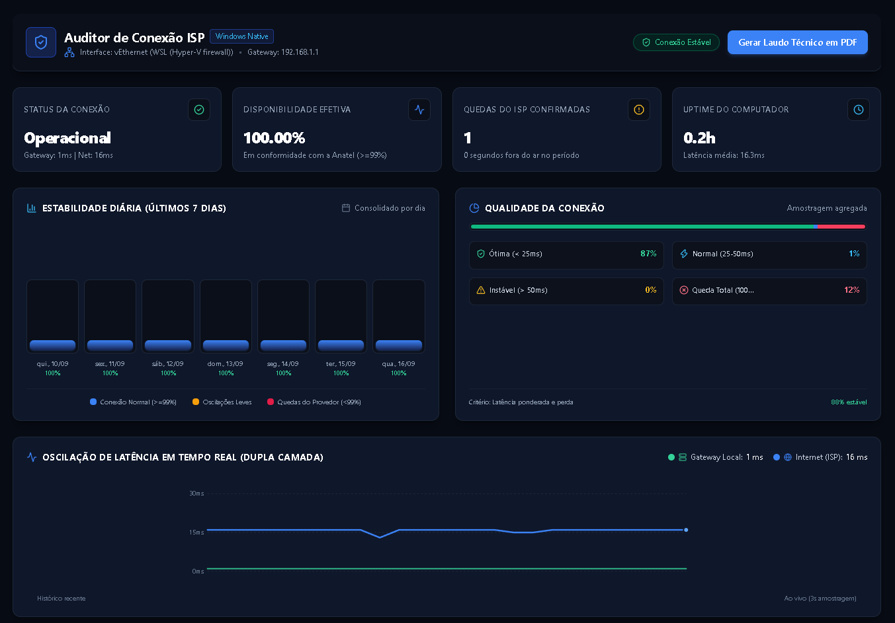

<div align="center">

# 🛡️ Monitor de Conexão ISP & Auditoria de Quedas

<p align="center">
  
</p>

**Software desktop profissional para Windows que monitora silenciosamente sua internet, diferencia quedas do link da operadora de oscilações do Wi-Fi local e gera laudos técnicos periciais em PDF com Hash SHA-256 para comprovação irrefutável na Anatel, Procon e Ouvidorias.**

<p align="center">
  <a href="https://github.com/decsters01/isp-drop-monitor/releases/download/v1.0.0/Monitor.de.Conexao.ISP.Setup.1.0.0.exe">
    
  </a>
  <a href="https://github.com/decsters01/isp-drop-monitor/releases/download/v1.0.0/Monitor.de.Conexao.ISP.1.0.0.exe">
    
  </a>
</p>

<p align="center">
  
  
  
  
</p>

</div>

---

## 📥 Downloads Diretos (Windows 10 / 11)

| Tipo | Arquivo | Tamanho | Instruções | Link Direto |
| :--- | :--- | :---: | :--- | :---: |
| **Instalador Oficial** | `Monitor de Conexao ISP Setup 1.0.0.exe` | ~91 MB | Instalação rápida em 1 clique, cria atalhos na Área de Trabalho e Menu Iniciar. | [⬇️ **Download Instalador (.exe)**](https://github.com/decsters01/isp-drop-monitor/releases/download/v1.0.0/Monitor.de.Conexao.ISP.Setup.1.0.0.exe) |
| **Versão Portátil** | `Monitor de Conexao ISP 1.0.0.exe` | ~91 MB | Não requer instalação. Dê dois cliques para rodar direto de qualquer pasta ou pendrive. | [📦 **Download Portátil (.exe)**](https://github.com/decsters01/isp-drop-monitor/releases/download/v1.0.0/Monitor.de.Conexao.ISP.1.0.0.exe) |

> 💡 **Nota de Segurança**: O software não requer permissões de Administrador para ser instalado ou executado. Todo o monitoramento roda sob credenciais normais de usuário do Windows.

---

## 🛑 Por que este software foi criado? (A dor que ele resolve)

Quem trabalha em home office, faz reuniões pelo Teams/Google Meet, estuda ou joga online já passou por essa situação:

1. **A sua internet cai várias vezes durante o dia**, travando chamadas, perdendo dados e interrompendo seu trabalho.
2. Você liga no suporte técnico do provedor de internet (Claro, Vivo, Oi, provedores locais, etc.).
3. O atendente pede para você desligar o roteador por 10 segundos, liga novamente e executa um teste rápido de velocidade de 30 segundos.
4. Por coincidência, naquele momento a conexão voltou a responder, e o atendente encerra o protocolo dizendo:
   > *"Senhor(a), aqui no nosso sistema o sinal da sua fibra está excelente e sem falhas. O problema deve ser interferência no seu Wi-Fi ou no seu computador."*
5. Você continua sofrendo com microquedas diárias, acumulando prejuízos, e fica sem amparo porque **não tem como provar tecnicamente que o problema está na rede da operadora**.

O **Monitor de Conexão ISP** foi criado para colocar nas mãos do consumidor uma **ferramenta de auditoria técnica incontestável**.

---

## 🔬 Como o software prova que a culpa é da operadora?

### 1. Auditoria de Dupla Camada Simultânea (Dual-Layer)
Para neutralizar a desculpa clássica de que *"o defeito é o seu roteador Wi-Fi"*, o motor dispara sondagens simultâneas a cada 3 segundos em duas frentes:
- **Camada Local:** Comunica-se com o Gateway Padrão (o IP do roteador dentro da sua residência, ex.: `192.168.1.1`).
- **Camada Externa (Internet):** Comunica-se com servidores mundiais de altíssima disponibilidade (`1.1.1.1` da Cloudflare e `8.8.8.8` do Google).

```text
       [Seu Computador]
             │
     ┌───────┴───────┐
     ▼               ▼
[Roteador Local]   [Internet Externa]
 (192.168.1.1)    (1.1.1.1 / 8.8.8.8)
     │                   │
    0ms                 FALHA (Timeout)
     │                   │
     └─────────┬─────────┘
               ▼
   [DIAGNÓSTICO INCONTESTÁVEL]
   Wi-Fi local: 100% ÍNTEGRO
   Falha: EXCLUSIVA DA OPERADORA (ISP)
```

> **A Prova Técnica:**  
> Se o roteador da sua casa responder com **0% de perda de pacotes e latência de 1ms**, mas a internet externa parar de responder simultaneamente por mais de 5 segundos, **fica matematicamente demonstrado que o seu Wi-Fi está perfeito e que o link externo da operadora foi interrompido.**

### 2. Auditoria Real de Uptime do PC (Horas Ligado vs. Desligado)
O provedor não pode alegar que você ficou sem sinal porque seu computador estava desligado.
- O software mantém um batimento periódico (*heartbeat*) gravado no banco de dados local SQLite a cada 30 segundos.
- Mapeia com exatidão os períodos de inicialização (boot), encerramento e suspensão de energia (Sleep/Resume) do Windows.
- O cálculo de disponibilidade da internet é feito **estritamente em relação ao tempo em que o computador esteve operacional**, entregando um percentual exato e auditável.

### 3. Resiliência com Fallback TCP Inteligente
Muitos roteadores de operadoras vêm configurados para bloquear ping (ICMP Echo). O software detecta esse bloqueio automaticamente e aciona um **handshake TCP nas portas 53 (DNS), 80 (HTTP) ou 443 (HTTPS)** do roteador, comprovando a integridade da comunicação local sem falsos alertas.

### 4. Emissão de Laudo Técnico Pericial em PDF com Hash SHA-256
Com um único clique no botão **"Gerar Laudo Técnico em PDF"**, o software compila um documento oficial contendo:
- Nome do titular, operadora, número do contrato e protocolo de atendimento contestado.
- Resumo executivo de horas monitoradas vs. tempo acumulado de indisponibilidade da operadora.
- Comparativo com a meta regulatória da Anatel (**mínimo de 99.00% de disponibilidade**).
- Tabela cronológica de todas as interrupções com data, horário de início, horário de término e duração em segundos.
- **Hash Criptográfico SHA-256** e Identificador Único de Emissão no rodapé para garantir que o laudo não sofreu edições após a emissão.

---

## 📊 Recursos do Dashboard (Paleta Dark Preto e Azul)

- **Layout Escuro de Alto Contraste:** Interface moderna projetada em `#070B14` e `#0B0F19` com cartões em `#0F172A` e acentos em `#3B82F6` (azul).
- **Cards de Métricas em Tempo Real:** Status atual da rede, disponibilidade efetiva acumulada (%), contagem de quedas e tempo operacional do PC.
- **Múltiplos Gráficos Analíticos Integrados:**
  - *Latência em Tempo Real:* Gráfico SVG a 60 FPS comparando a latência local do roteador contra a internet.
  - *Estabilidade Diária:* Gráfico de barras dos últimos 7 dias comparando horas de uso contra minutos de indisponibilidade.
  - *Distribuição de Qualidade:* Painel categorizando a conexão entre Ótima, Normal, Instável e Queda Total.
- **Tabela com Busca e Filtros:** Pesquisa por data/hora e filtros rápidos (*Todos*, *Apenas ISP*, *Apenas Local*).
- **Operação Silenciosa na Bandeja (System Tray):**
  - Ao clicar no "X", a janela fecha mas o monitor continua rodando discretamente ao lado do relógio do Windows.
  - Notificações nativas do Windows avisam no exato segundo em que uma queda da operadora for confirmada.
  - Para reabrir, basta dar duplo clique no ícone da bandeja.

---

## 🛠️ Como Instalar e Utilizar (Passo a Passo)

### Modo Simples (Para Usuários Finais):
1. Acesse o link de download direto:  
   👉 [**Baixar Monitor de Conexao ISP Setup 1.0.0.exe**](https://github.com/decsters01/isp-drop-monitor/releases/download/v1.0.0/Monitor.de.Conexao.ISP.Setup.1.0.0.exe)
2. Execute o instalador baixado (a instalação ocorre em segundos sem pedir senha de administrador).
3. O programa abrirá automaticamente e começará a auditar sua rede.
4. Você pode deixar ele aberto ou simplesmente fechar a janela no "X" — ele continuará monitorando na bandeja do relógio.
5. Quando precisar comprovar as quedas para o provedor ou abrir reclamação no Procon/Anatel, abra o aplicativo, clique em **"Gerar Laudo Técnico em PDF"**, preencha os dados da sua conta e clique em **"Exportar Laudo em PDF"**.

---

### Modo Desenvolvedor (Executar ou Compilar o Código-Fonte):
```bash
# 1. Clonar o repositório
git clone https://github.com/decsters01/isp-drop-monitor.git
cd isp-drop-monitor

# 2. Instalar as dependências do projeto
npm install

# 3. Iniciar a aplicação em modo de desenvolvimento
npm run dev

# 4. Executar os testes unitários automatizados (Vitest)
npm test

# 5. Compilar novos arquivos executáveis (.exe) na pasta release/
npm run build:exe
```

---

## ⚖️ Base Legal e Regulatória no Brasil (Anatel e CDC)

O laudo emitido por esta aplicação fornece subsídios fundamentados na legislação brasileira de telecomunicações:
- **Resolução nº 574/2011 da Anatel (R-QST):** Estabelece que os provedores de banda larga fixa devem garantir índices de qualidade, velocidade instantânea e disponibilidade contínua da rede.
- **Resolução nº 632/2014 da Anatel (Regulamento Geral de Direitos do Consumidor - RGC):**
  - **Art. 46:** Determina o **abatimento proporcional na fatura** mensal por qualquer interrupção do serviço superior a 30 minutos.
  - **Art. 58:** Assegura ao consumidor o direito de **rescindir o contrato sem pagamento de multa de fidelidade** caso a prestadora descumpra reiteradamente as condições de qualidade contratadas.
- **Código de Defesa do Consumidor (Lei nº 8.078/1990 - Art. 6º, VI e Art. 20):** Garante a efetiva reparação por serviços impróprios ou descontínuos.

---

## 📄 Licença

Este projeto é software livre licenciado sob a [Licença MIT](LICENSE). Criado para democratizar o acesso a diagnósticos técnicos de rede e proteger os direitos dos consumidores.
